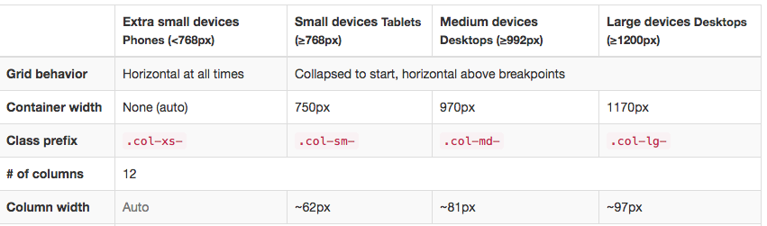

# build-a-porfolio-site

## problem sets

* I spend a lot of time on adjusting the header layout. It's really driving me crazy.
* I put the Flash logo and the author description into `col-sm-3` and `col-sm-9`. And what I wanted to do is :
    * the logo on the left 
    * the text on the right
    * they are horizontal algined while responsive
* I tried adding padding or margin to the text, in order to make them look algined, but while I zoom in or out, it is broken.
* I tried adding `margin: auto 0` to both of them (`margin: 0 auto ` works well so I think it may work too), but it didn't work.

 since I am a Chinese, I don't know if I've expressed my purpose explictly. So I made a [handwriting picture](problemset.jpg) for you to understand.
 
 * Thanks for reading so far. The last problem is that while I am using bootstrap grid system (the .container is **responsive fixed** ), how to set the images' sizes attribute?
 *  As I know, sizes are vw units, if I were using .container-fluid, I can simply use 1/12 of 100vw for a single column which containing my image (telling the browser that my image is 1/12 viewport width). While the container's width is fixed though responsive, I don't know what to do. Getting the column px number from bootstrap documentation and transform them into percentage?
 
 
 * like this: ```sizes = "(min-width:1200px), calc(97/1170) vw"``` for a single column 
 
 
# Thanks sincerely

# solution from reviewer

1. You are right the property margin: auto 0; won’t work for vertical centring. The auto property is used in conjunction with the margin property for horizontal centring. Since you are using bootstrap there are two ways to go about it. One is a sort of a hack : <http://stackoverflow.com/questions/20547819/vertical-align-with-bootstrap-3>  mentioned in the linked post. I would not suggest using that. The other would be to use flexbox (also mentioned in the linked post ) . You have to apply the following style to the row class. 

```
 .row { 
    display: flex; 
    align-items: center;

}
```

Make sure you apply this on medium to larger screens and use the default bootstrap styling on smaller screen using a media query else the design will look distorted. 

2. Regarding your second question it is totally acceptable to use the class container-fluid which will save you a lot of trouble in the calculations and instead of calculating the percentages your single column  will be (as you pointed out) 1/12 of the viewport size i.e. 100vw. 
 